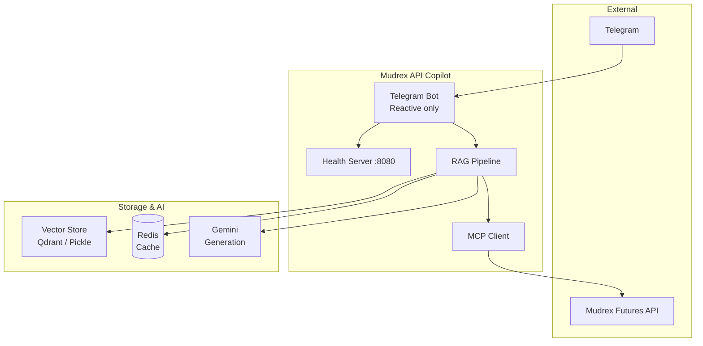
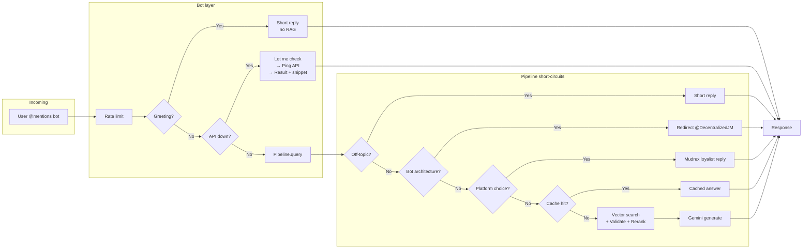
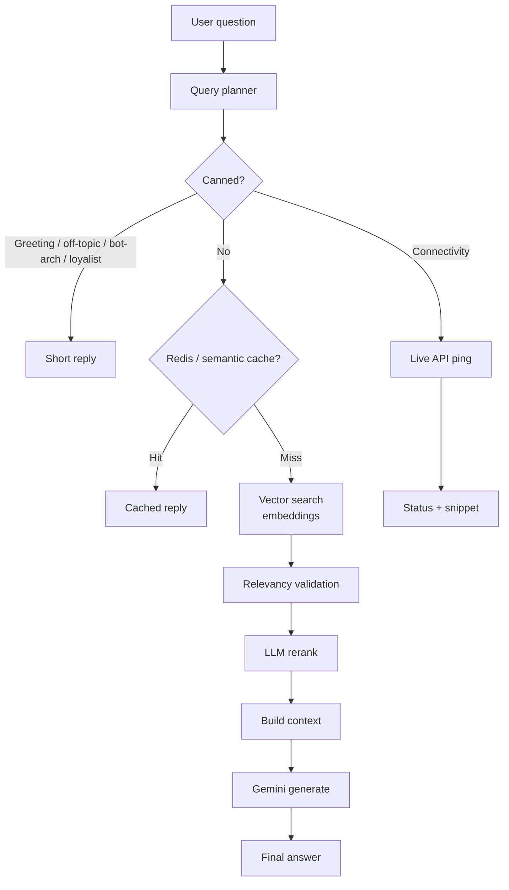
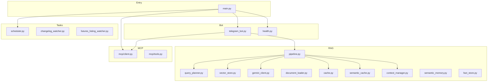

```text
███╗   ███╗██╗   ██╗██████╗ ██████╗ ███████╗██╗  ██╗
████╗ ████║██║   ██║██╔══██╗██╔══██╗██╔════╝╚██╗██╔╝
██╔████╔██║██║   ██║██║  ██║██████╔╝█████╗   ╚███╔╝ 
██║╚██╔╝██║██║   ██║██║  ██║██╔══██╗██╔══╝   ██╔██╗ 
██║ ╚═╝ ██║╚██████╔╝██████╔╝██║  ██║███████╗██╔╝ ██╗
╚═╝     ╚═╝ ╚═════╝ ╚═════╝ ╚═╝  ╚═╝╚══════╝╚═╝  ╚═╝
 █████╗ ██████╗ ██╗ ██████╗ ██████╗ ██████╗ ██╗██╗      ██████╗ ████████╗
██╔══██╗██╔══██╗██║██╔════╝██╔═══██╗██╔══██╗██║██║     ██╔═══██╗╚══██╔══╝
███████║██████╔╝██║██║     ██║   ██║██████╔╝██║██║     ██║   ██║   ██║   
██╔══██║██╔═══╝ ██║██║     ██║   ██║██╔═══╝ ██║██║     ██║   ██║   ██║   
██║  ██║██║     ██║╚██████╗╚██████╔╝██║     ██║███████╗╚██████╔╝   ██║   
╚═╝  ╚═╝╚═╝     ╚═╝ ╚═════╝ ╚═════╝ ╚═╝     ╚═╝╚══════╝ ╚═════╝    ╚═╝   
```

An **API Copilot** for the Mudrex Futures API community. Helps developers with code examples, API integration, error debugging, and onboarding.

> **Reactive mode:** The bot responds only when explicitly engaged (@mentioned, replied to, or quote+mention). It does not auto-respond to keywords.

---

## Table of contents

- [Recent updates](#-recent-updates)
- [Features](#-features)
- [Architecture](#-architecture)
- [Quick start](#-quick-start)
- [Project structure](#-project-structure)
- [Bot commands](#-bot-commands)
- [When the bot responds](#-when-the-bot-responds)
- [MCP integration](#-mcp-integration)
- [RAG pipeline](#-rag-pipeline)
- [Bot persona](#-bot-persona)
- [Environment variables](#-environment-variables)
- [Community resources](#-community-resources)
- [Development & deployment](#-development--deployment)
- [License & author](#-license--author)

---

## Recent updates

| Area | Change |
|------|--------|
| **Railway** | SIGTERM handler so the bot stops polling immediately on deploy; `drop_pending_updates` on start; 25s startup delay; single-replica recommended. |
| **API check** | “Is API down?” → two-step reply: “Let me check.” → typing → live ping result + test snippet + “share error code if you need help.” |
| **Greetings** | “How are you” and similar get a short reply only (no code/scripts). |
| **Confidentiality** | Questions about how the copilot works or building a similar bot → redirect to @DecentralizedJM. |
| **Mudrex loyalist** | “Which platform?” / “Is Mudrex reliable?” → praise Mudrex + “I’m here to help.” |
| **Coming soon** | Klines, Webhooks, TradingView, subbroker, INR Futures, WebSockets → “on the roadmap / product prioritized” style replies. |
| **Hallucination** | Legacy docs removed; strict endpoint validation; template responses for missing features. |

---

## Features

| Category | Description |
|----------|-------------|
| **Code-first** | Working Python/JS snippets for “how to” questions; no scripts for greetings. |
| **Error debugging** | Analyzes logs, error codes, and suggests fixes. |
| **RAG pipeline** | Query planning, vector search, relevancy validation, rerank, Gemini generation. |
| **Hallucination prevention** | Only Mudrex docs; validated context; template replies for known missing features. |
| **Live API check** | “Is API down?” triggers a real HTTP ping and returns status + test snippet. |
| **MCP** | Live market data via Mudrex MCP (500+ futures pairs). |
| **Caching** | Redis for query/response and semantic cache to reduce Gemini calls. |
| **Context** | Conversation context and semantic memory for follow-ups. |

---

## Architecture

### High-level system



### Request flow (message → response)



### RAG pipeline stages



### Component diagram



---

## Quick start

### 1. Clone & install

```bash
git clone https://github.com/DecentralizedJM/Mudrex-API-Copilot.git
cd Mudrex-API-Copilot

python3 -m venv venv
source venv/bin/activate   # Windows: venv\Scripts\activate

pip install -r requirements.txt
```

### 2. Configure

```bash
cp .env.example .env
```

**Required:**

| Variable | Description |
|----------|-------------|
| `TELEGRAM_BOT_TOKEN` | Telegram bot token |
| `GEMINI_API_KEY` | Google Gemini API key |

**Optional:**

| Variable | Description |
|----------|-------------|
| `MUDREX_API_SECRET` | Mudrex API secret (live data, MCP) |
| `REDIS_URL` | Redis URL (caching) |
| `ADMIN_USER_IDS` | Comma-separated admin Telegram IDs |
| `QDRANT_URL` / `QDRANT_API_KEY` | Qdrant Cloud (production vector store) |

### 3. Run

```bash
python3 main.py
```

---

## Project structure

```
├── main.py                    # Entry point; health server; RAG + MCP + bot init
├── railway.json               # Railway deploy (overlap=0, draining=30)
├── Dockerfile
├── requirements.txt
├── .env.example
│
├── src/
│   ├── bot/
│   │   └── telegram_bot.py    # Reactive handlers; rate limit; connectivity 2-step
│   ├── config/
│   │   └── settings.py       # Config and validation
│   ├── health.py              # Health server (Railway)
│   ├── rag/
│   │   ├── pipeline.py      # Query orchestration; short-circuits; RAG stages
│   │   ├── query_planner.py  # Greeting / code / error / mudrex classification
│   │   ├── vector_store.py   # Embeddings; Qdrant or pickle
│   │   ├── gemini_client.py  # Gemini generate; missing-feature templates
│   │   ├── document_loader.py
│   │   ├── cache.py          # Redis query/response cache
│   │   ├── semantic_cache.py # Similar-query cache
│   │   ├── context_manager.py
│   │   ├── semantic_memory.py
│   │   └── fact_store.py
│   ├── mcp/
│   │   ├── client.py         # MCP connection and tools
│   │   └── tools.py
│   └── tasks/
│       ├── scheduler.py      # Daily changelog scrape + ingest
│       ├── changelog_watcher.py
│       └── futures_listing_watcher.py
│
├── docs/                      # RAG source (Markdown)
├── scripts/
│   ├── ingest_docs.py        # Ingest docs into vector store
│   ├── scrape_docs.py        # Scrape API docs
│   └── scrape_api_docs.py
│
└── tests/
```

---

## Bot commands

| Command | Description |
|---------|-------------|
| `/help` | Help and usage |
| `/endpoints` | API endpoints with doc links |
| `/listfutures` | Count of futures pairs |
| `/tools` | MCP tools list |
| `/mcp` | MCP setup for Claude Desktop |
| `/stats` | Bot stats (admin) |

**Admin:** `/learn <text>`, `/set_fact KEY value`, `/delete_fact KEY`

---

## When the bot responds

The bot is **reactive only**:

1. **@mentioned** in a message  
2. **Replied to** (continuation)  
3. **Quote + mention** (reply to someone else’s message and tag the bot)

It does **not** respond to plain keywords without engagement.

---

## MCP integration

Live data via Mudrex MCP. Read-only tools: `list_futures`, `get_future`, `get_orders`, `get_positions`, `get_leverage`, `get_liquidation_price`, `get_available_funds`, `get_fee_history`, etc. Write/confirm tools: `place_order`, `cancel_order`, `close_position`, `set_leverage`, etc.

**Claude Desktop config:**

```json
{
  "mcpServers": {
    "mcp-futures-trading": {
      "command": "npx",
      "args": ["-y", "mcp-remote", "https://mudrex.com/mcp", "--header", "X-Authentication:${API_SECRET}"],
      "env": {"API_SECRET": "<your-api-secret>"}
    }
  }
}
```

Docs: https://docs.trade.mudrex.com/docs/mcp

---

## RAG pipeline

1. **Query planner** — Canned (greeting, off-topic, bot-arch, loyalist), connectivity, or full RAG.  
2. **Short-circuits** — Off-topic, bot-architecture, Mudrex loyalist, API-down ping, cache.  
3. **Retrieval** — Vector search → relevancy validation → rerank.  
4. **Generation** — Context + Gemini; template responses for missing features (Klines, Webhooks, TradingView, etc.).  

**Hallucination prevention:** Only Mudrex docs in context; relevancy threshold; “coming soon” templates for known missing features.

---

## Bot persona

- **Does:** Code examples (when asked), error debugging, auth/docs links, Mudrex-positive answers for “which platform?”  
- **Doesn’t:** Auto-respond to keywords, give trading advice, explain how the copilot is built (→ @DecentralizedJM).  
- **Out of scope:** “Couldn’t find that. Docs: https://docs.trade.mudrex.com — @DecentralizedJM can help.”

---

## Environment variables

| Variable | Required | Default | Description |
|----------|----------|---------|-------------|
| `TELEGRAM_BOT_TOKEN` | Yes | - | Telegram bot token |
| `GEMINI_API_KEY` | Yes | - | Gemini API key |
| `MUDREX_API_SECRET` | No | - | Mudrex API secret |
| `GEMINI_MODEL` | No | `gemini-3-flash-preview` | Gemini model |
| `REDIS_ENABLED` | No | `false` | Enable Redis cache |
| `REDIS_URL` | No | `redis://localhost:6379` | Redis URL |
| `QDRANT_URL` / `QDRANT_API_KEY` | No | - | Qdrant Cloud |
| `ADMIN_USER_IDS` | No | - | Admin Telegram IDs |
| `ALLOWED_CHAT_IDS` | No | - | Allowed group IDs |
| `BOT_STARTUP_DELAY` | No | 25 (Railway) | Seconds before bot starts (deploy conflict) |
| `SIMILARITY_THRESHOLD` | No | `0.45` | Vector similarity |
| `RELEVANCY_THRESHOLD` | No | `0.6` | Doc relevancy min |
| `RERANK_TOP_K` | No | `5` | Docs after rerank |

---

## Community resources

- **Python SDK:** https://github.com/DecentralizedJM/mudrex-api-trading-python-sdk  
- **Trade Ideas Broadcaster:** https://github.com/DecentralizedJM/TIA-Service-Broadcaster  
- **API docs:** https://docs.trade.mudrex.com  
- **MCP docs:** https://docs.trade.mudrex.com/docs/mcp  

---

## Development & deployment

**Local:**

```bash
LOG_LEVEL=DEBUG python3 main.py
python3 scripts/scrape_docs.py && python3 scripts/ingest_docs.py
```

**Railway:**

1. Connect GitHub repo.  
2. Set env vars (token, Gemini, optional Redis, Qdrant).  
3. Use **one replica** to avoid Telegram Conflict.  
4. Optionally set `BOT_STARTUP_DELAY=40` if conflicts persist.  

See `docs/troubleshooting_bot.md` for Telegram 409 Conflict.

---

## License & author

**License:** MIT — see [LICENSE](LICENSE).  
**Author:** [DecentralizedJM](https://github.com/DecentralizedJM)  

*Built for the Mudrex developer community*
